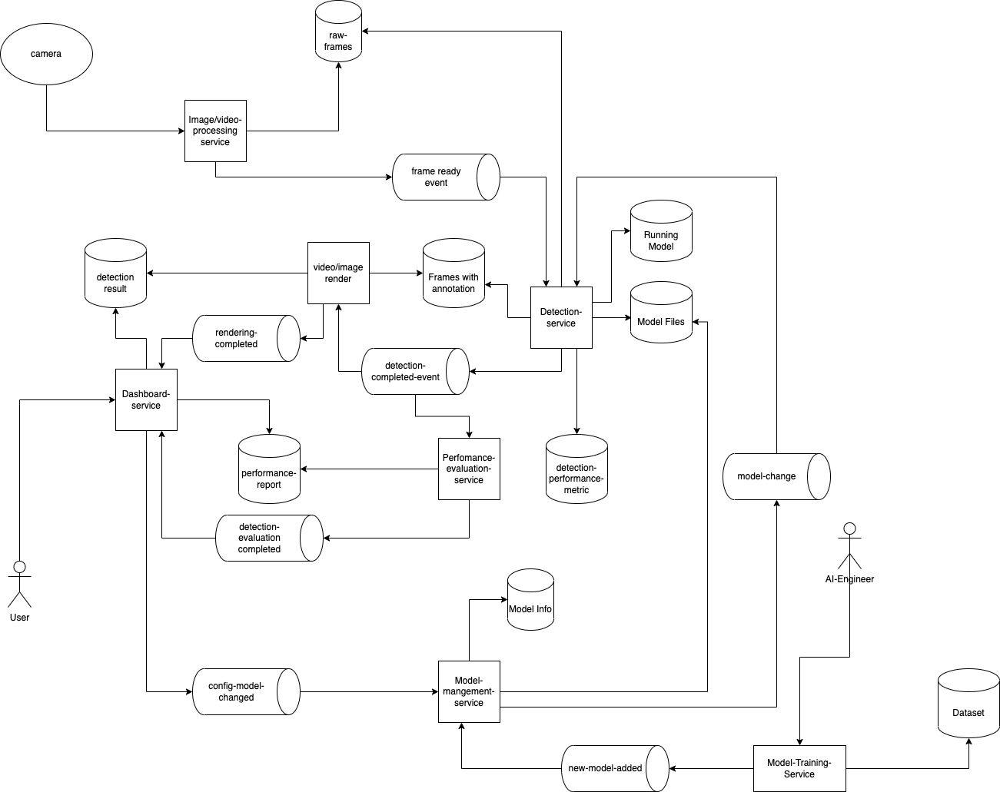

# detection-app-system-design
# Architecture

In this system, **Kafka** is used as the coordinator, service to service communication is an event. It makes sure that services loose coupling

**image/video-processing-service**
- Responsibility: to decode data and persist to storage as frames
- Tech: Python, opencv (a mature library for image and video processing). 
- GPU intensive

**raw-frames**
- Responsibility: storing decoded frames which will be used for detection-service.
- Tech: minio or s3
- minio and s3 have the same API interfaces, it's so easy to switch between them. Additionally, the performance is good enough for storing high-rate access data.

**detection-service**
- Responsibility: execute object detection, the ouput is frames with annotations(bounding box, metadata) and stored into a file storage by using a AI model. AI models will be managed by model-service.
- Tech: Pytorch or tensorflow
- GPU intensive

**model-management-service** + **model-info**
- Responsibility: Store, annotate, discover, and manage models in a central repository
- Tech: MLflow (opensource platform having high stars in github)

**frames-with-annotations**
- Responsibility: storing detected frames with annotations.
- Tech: minio or s3

**Running-model**
- Responsibility: store configurations (model file name, client id). The configuration will be different between clients.
- Tech: Postgres (OLTP) to guarantee consistency. a user is not happy if detection configuration is unexpect overrided
The Read workload is larger than the write, caching layer could be used between detection-service and running model storage.

**model-files**
- Responsibility: Store model files (ONNX, .pt, .pth, .pwf)...
- Tech: minio or s3

**detection-performance-metric**
- Responsibility: Store logs about the performance each model after a detection process is completed.
- Tech: The write workload is larger than read, I consider persist as log files or NoSQL like mongo, couchdb...

**performance-evaluating-service**
- Responsibility: aggregate events in order to make reports and send to dashboard. Users can check if Accuracy and performance is good enough.
- Tech: spark or hadoop

**performance-report**
- Responsibility: store the output of performance-evaluating-service
- Tech: elasticsearch or couchbase. Any OLAP database could be used.

**video/image-renderer**
- Responsibility: put frames and annotations together, and transform them to video/image send to dashboard.
- Tech: Python + ffmpeg
GPU intensive

**detection-result**
- Responsibility: store the output of the render.
- Tech: minio or s3(consider cost when storing a large video).

**dashboard-service**
- Responsibility: a web-app for users interacting, monitor detection results(video, image, performance metric), change model configuration.
- Tech: go, java, nodejs....

**model-training-service**
- Responsibility: for AI engineers to train model, output is models used in detection.
- Tech: pytorch
**dataset**
- Responsibility: I assume that we have dataset which annotated before. I skip the step data gathering stage.
- Tech: file storage(minio or s3)

# Traffic estimation
- Network: Camera using **RTSP** to send data as stream, average fps ~ 60 (it depends on camera models)
```10 camera => ~ 600 fps, 100 camera => ~ 6000 fps```

- The decoder (**image/video-processing-service**) will be under pressure if more camera added. Moreover, **detection-service** handle frame by frame, more data coming more workload must be handled.

- Some detection systems, they improve detecting performance by batching frames or detecting key frames only then interpolate them.

- GPU is more expensive than CPU


